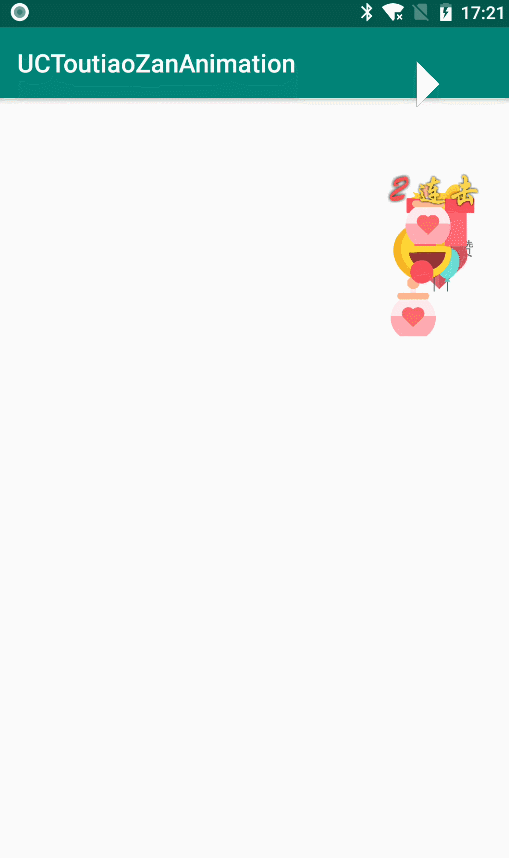
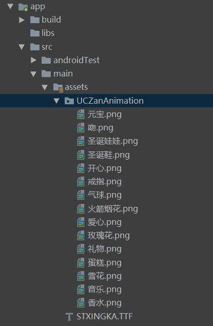

# UC浏览器 新闻头条点赞动画

采用Surfaceview自定义的.

效果如下:

### 用法:

1.  在界面的根布局添加一个FrameLayout, 要放在界面层级的最上层

        <?xml version="1.0" encoding="utf-8"?>
        <android.support.constraint.ConstraintLayout xmlns:android="http://schemas.android.com/apk/res/android"
            xmlns:app="http://schemas.android.com/apk/res-auto"
            xmlns:tools="http://schemas.android.com/tools"
            android:layout_width="match_parent"
            android:layout_height="match_parent"
            tools:context=".MainActivity">

            <LinearLayout
                android:id="@+id/zan_btn"
                android:layout_width="wrap_content"
                android:layout_height="wrap_content"
                android:layout_marginStart="8dp"
                android:layout_marginLeft="8dp"
                android:layout_marginTop="100dp"
                android:layout_marginBottom="97dp"
                android:gravity="center_vertical"
                android:padding="4dp"
                app:layout_constraintBottom_toBottomOf="parent"
                app:layout_constraintEnd_toEndOf="parent"
                app:layout_constraintHorizontal_bias="0.914"
                app:layout_constraintStart_toStartOf="parent"
                app:layout_constraintTop_toTopOf="parent"
                app:layout_constraintVertical_bias="0.0">

                <ImageView
                    android:layout_width="30dp"
                    android:layout_height="30dp"
                    android:src="@mipmap/zan" />

                <TextView
                    android:id="@+id/textView"
                    android:layout_width="wrap_content"
                    android:layout_height="wrap_content"
                    android:layout_marginStart="8dp"
                    android:layout_marginLeft="8dp"
                    android:text="赞" />
            </LinearLayout>

            <FrameLayout
                android:id="@+id/playground"
                android:layout_width="match_parent"
                android:layout_height="match_parent">

            </FrameLayout>

        </android.support.constraint.ConstraintLayout>

2. 在asset目录添加一个动画资源文件

3. 添加动画工程依赖
   将本工程的uczananimation库整合到项目中, 或者直接添加以下依赖:

        compile 'com.nicekun:uczananimation:1.0.0'

4. 在页面初始化的时候,进行初始化

            private void initView() {
                mZanBtn = findViewById(R.id.zan_btn);
                mPalyground = findViewById(R.id.playground);

                //设置动画资源
                UCZanAnimationResource ucZanAnimationResource = new UCZanAnimationResource.UCZanAnimationResourceBuilder(this)
                        //asset 目录下的放资源的子目录
                        .appendAssetResource("UCZanAnimation")
                        //设置动画资源 用来送惊喜的资源名称
                        .setSupriseFileNameOfAssets(new String[]{"玫瑰花", "元宝", "音乐", "玫瑰花"})
                        .build();

                mUcZanAnimation = new UCZanAnimation(this, mPalyground, ucZanAnimationResource);
                //设置点击次数文字的字体
                mUcZanAnimation.setTypeface(Typeface.createFromAsset(getAssets(), "STXINGKA.TTF"));

                mZanBtn.setOnClickListener(this);
            }

5. 在点击事件进行动画播放

        @Override
            public void onClick(View v) {
                if (v.getId() == R.id.zan_btn) {
                    mUcZanAnimation.play(v);
                }
            }